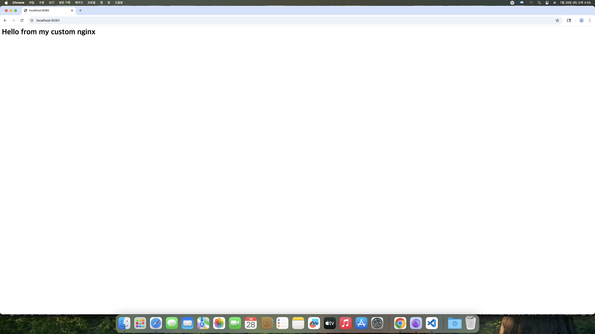
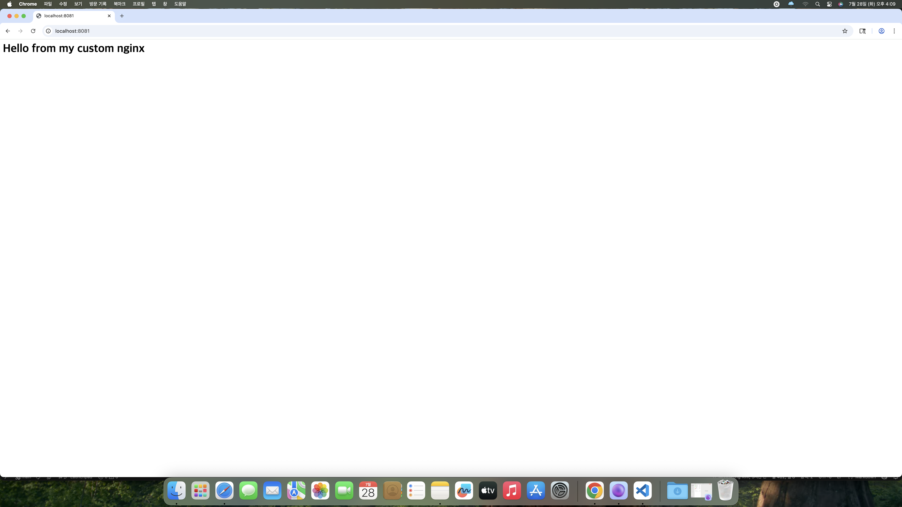
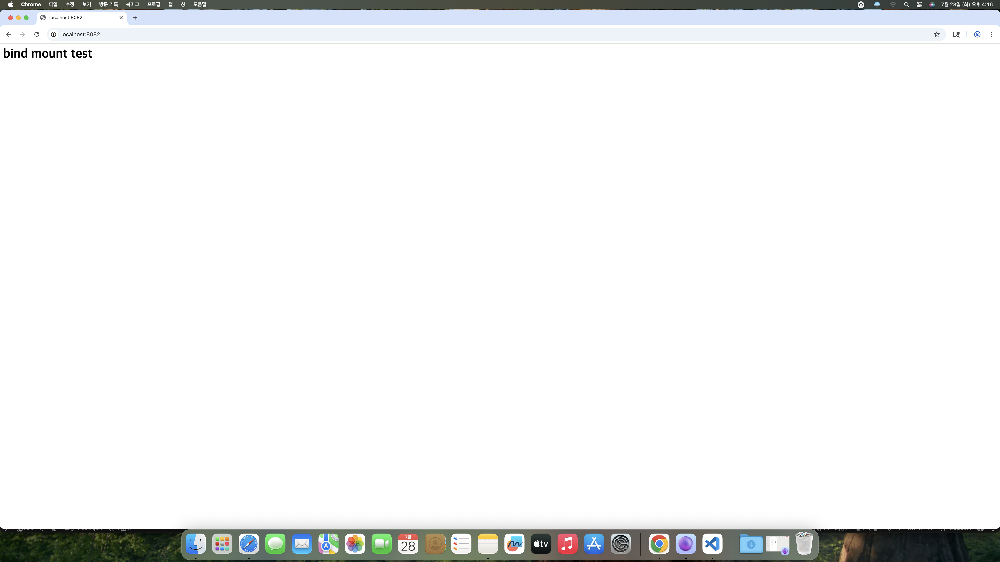
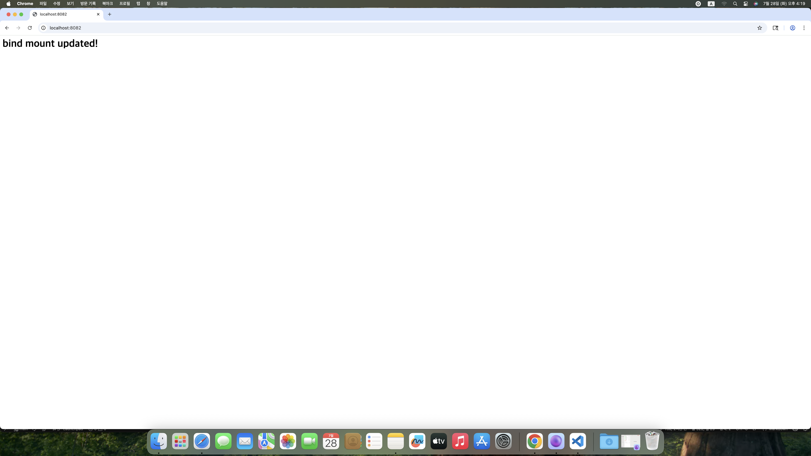
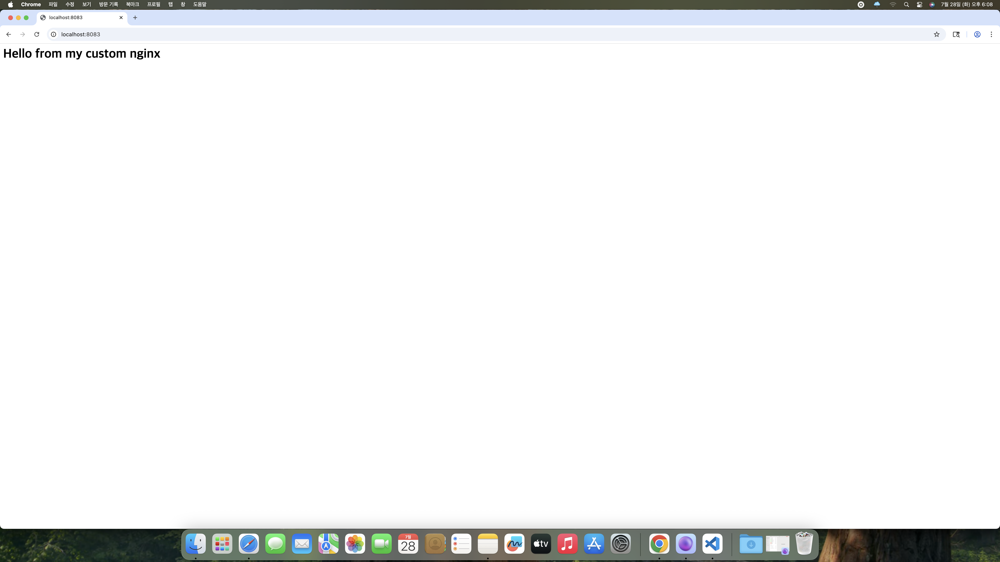

# 1번 미션 — 터미널/권한/Docker/Git 실습

## 0) 프로젝트 개요 (미션 목표 요약)
- 이 저장소는 터미널 기본 조작, 리눅스 파일 권한 실습, Docker 설치/운영, 커스텀 Dockerfile 제작,
  포트 매핑, 볼륨 영속성 검증, Git/GitHub 제출까지의 전 과정을 수행하고 기록한 결과물이다.

## 1) 실행 환경
- OS: macOS 15.7.4
- Shell: zsh
- Docker: 28.5.2
- OrbStack: 2.0.5
- Git: 2.53.0

Docker 버전 확인
```bash
[user]@[host] Codyssey_1 % docker --version
Docker version 28.5.2, build ecc6942
```

Git 버전 확인
```bash
[user]@[host] Codyssey_1 % git --version
git version 2.53.0
```


## 2) 수행 항목 체크리스트
- [X] 터미널 기본 조작 (이동/목록/생성/복사/이동·이름변경/삭제/내용확인/빈파일생성)
- [X] 권한 변경 실습 (파일 1개 + 디렉토리 1개, 변경 전/후 비교)
- [X] Docker 설치/점검 (`docker --version`, `docker info`)
- [X] Docker 기본 운영 명령 (images/ps/logs/stats)
- [X] hello-world 실행
- [x] ubuntu 컨테이너 진입 및 명령 수행 (ls, echo)
- [X] 컨테이너 종료/유지(attach vs exec) 관찰 정리
- [X] 커스텀 Dockerfile 작성 및 이미지 빌드/실행
- [X] 포트 매핑 및 접속 증거 (2회 이상)
- [X] 바인드 마운트 반영 확인
- [X] Docker 볼륨 생성/연결/영속성 검증
- [X] Git 설정 및 GitHub 업로드


## 3) 터미널 조작 로그

현재 위치 확인
```bash
[user]@[host] Codyssey_1 % pwd
/Users/[user]/Desktop/Codyssey_1
```

목록 확인 (숨김 파일 포함)
```bash
[user]@[host] Codyssey_1 % ls -la
total 16
drwxr-xr-x   4 [user]  [user]   128 Jul 28 12:33 .
drwx------+  5 [user]  [user]   160 Jul 28 12:33 ..
drwxr-xr-x  13 [user]  [user]   416 Jul 28 12:38 .git
-rw-r--r--   1 [user]  [user]  6483 Jul 28 12:33 README.md
```

디렉토리 생성 및 이동
```bash
[user]@[host] Codyssey_1 % mkdir -p codyssey/mission1
[user]@[host] Codyssey_1 % cd codyssey/mission1
[user]@[host] mission1 % 
```

빈 파일 생성 및 내용 작성/확인
```bash
[user]@[host] mission1 % touch memo.txt
[user]@[host] mission1 % echo "hello, codyssey" > memo.txt
[user]@[host] mission1 % cat memo.txt
hello, codyssey
```

파일 복사
```bash
[user]@[host] mission1 % cp memo.txt memo_copy.txt
```

파일 이름 변경 (이동)
```bash
[user]@[host] mission1 % mv memo_copy.txt memo_renamed.txt
[user]@[host] mission1 % cat memo_renamed.txt
hello, codyssey
```

빈 파일 생성 및 삭제
```bash
[user]@[host] mission1 % touch empty.txt
[user]@[host] mission1 % rm memo_renamed.txt
[user]@[host] mission1 % ls -la
total 24
drwxr-xr-x  5 [user]  [user]   160 Jul 28 13:13 .
drwxr-xr-x  4 [user]  [user]   128 Jul 28 13:11 ..
-rw-r--r--@ 1 [user]  [user]  6148 Jul 28 13:11 .DS_Store
-rw-r--r--  1 [user]  [user]     0 Jul 28 13:13 empty.txt
-rw-r--r--  1 [user]  [user]    16 Jul 28 13:11 memo.txt
```


## 4) 권한 실습 (변경 전/후 비교)

### 파일 권한

파일 생성 및 변경 전 권한 확인
```bash
[user]@[host] mission1 % touch perm_test.txt
[user]@[host] mission1 % ls -l perm_test.txt
-rw-r--r--  1 [user]  [user]  0 Jul 28 13:13 perm_test.txt
```

권한 변경 (644 → 600) 후 재확인
```bash
[user]@[host] mission1 % chmod 600 perm_test.txt
[user]@[host] mission1 % ls -l perm_test.txt
-rw-------  1 [user]  [user]  0 Jul 28 13:13 perm_test.txt
```

### 디렉토리 권한

디렉토리 생성 및 변경 전 권한 확인
```bash
[user]@[host] mission1 % mkdir perm_dir
[user]@[host] mission1 % ls -la perm_dir
total 0
drwxr-xr-x  2 [user]  [user]   64 Jul 28 13:15 .
drwxr-xr-x  7 [user]  [user]  224 Jul 28 13:15 ..
```

권한 변경 (755 → 700) 후 재확인
```bash
[user]@[host] mission1 % chmod 700 perm_dir
[user]@[host] mission1 % ls -ld perm_dir
drwx------  2 [user]  [user]  64 Jul 28 13:15 perm_dir
```


## 5) Docker 설치 및 기본 점검

Docker 클라이언트 버전 확인
```bash
[user]@[host] mission1 % docker --version
Docker version 28.5.2, build ecc6942
```

Docker 데몬 동작 여부 확인
```bash
[user]@[host] mission1 % docker info
Client:
 Version:    28.5.2
 Context:    orbstack
 Debug Mode: false
 Plugins:
  buildx: Docker Buildx (Docker Inc.)
    Version:  v0.29.1
    Path:     /Users/[user]/.docker/cli-plugins/docker-buildx
  compose: Docker Compose (Docker Inc.)
    Version:  v2.40.3
    Path:     /Users/[user]/.docker/cli-plugins/docker-compose

Server:
 Containers: 0
  Running: 0
  Paused: 0
  Stopped: 0
 Images: 0
 Server Version: 28.5.2
 Storage Driver: overlay2
  Backing Filesystem: btrfs
  Supports d_type: true
  Using metacopy: false
  Native Overlay Diff: true
  userxattr: false
 Logging Driver: json-file
 Cgroup Driver: cgroupfs
 Cgroup Version: 2
 Plugins:
  Volume: local
  Network: bridge host ipvlan macvlan null overlay
  Log: awslogs fluentd gcplogs gelf journald json-file local splunk syslog
 CDI spec directories:
  /etc/cdi
  /var/run/cdi
 Swarm: inactive
 Runtimes: io.containerd.runc.v2 runc
 Default Runtime: runc
 Init Binary: docker-init
 containerd version: 1c4457e00facac03ce1d75f7b6777a7a851e5c41
 runc version: d842d7719497cc3b774fd71620278ac9e17710e0
 init version: de40ad0
 Security Options:
  seccomp
   Profile: builtin
  cgroupns
 Kernel Version: 6.17.8-orbstack-00308-g8f9c941121b1
 Operating System: OrbStack
 OSType: linux
 Architecture: x86_64
 CPUs: 6
 Total Memory: 15.67GiB
 Name: orbstack
 ID: b02bc96f-e857-407d-875f-6a991d946593
 Docker Root Dir: /var/lib/docker
 Debug Mode: false
 Experimental: false
 Insecure Registries:
  ::1/128
  127.0.0.0/8
 Live Restore Enabled: false
 Product License: Community Engine
 Default Address Pools:
   Base: 192.168.97.0/24, Size: 24
   Base: 192.168.107.0/24, Size: 24
   Base: 192.168.117.0/24, Size: 24
   Base: 192.168.147.0/24, Size: 24
   Base: 192.168.148.0/24, Size: 24
   Base: 192.168.155.0/24, Size: 24
   Base: 192.168.156.0/24, Size: 24
   Base: 192.168.158.0/24, Size: 24
   Base: 192.168.163.0/24, Size: 24
   Base: 192.168.164.0/24, Size: 24
   Base: 192.168.165.0/24, Size: 24
   Base: 192.168.166.0/24, Size: 24
   Base: 192.168.167.0/24, Size: 24
   Base: 192.168.171.0/24, Size: 24
   Base: 192.168.172.0/24, Size: 24
   Base: 192.168.181.0/24, Size: 24
   Base: 192.168.183.0/24, Size: 24
   Base: 192.168.186.0/24, Size: 24
   Base: 192.168.207.0/24, Size: 24
   Base: 192.168.214.0/24, Size: 24
   Base: 192.168.215.0/24, Size: 24
   Base: 192.168.216.0/24, Size: 24
   Base: 192.168.223.0/24, Size: 24
   Base: 192.168.227.0/24, Size: 24
   Base: 192.168.228.0/24, Size: 24
   Base: 192.168.229.0/24, Size: 24
   Base: 192.168.237.0/24, Size: 24
   Base: 192.168.239.0/24, Size: 24
   Base: 192.168.242.0/24, Size: 24
   Base: 192.168.247.0/24, Size: 24
   Base: fd07:b51a:cc66:d000::/56, Size: 64

WARNING: DOCKER_INSECURE_NO_IPTABLES_RAW is set
```


## 6) Docker 기본 운영 명령

이미지 목록 확인 (pull 전)
```bash
[user]@[host] mission1 % docker images
REPOSITORY   TAG       IMAGE ID   CREATED   SIZE
```

이미지 다운로드
```bash
[user]@[host] mission1 % docker pull nginx:alpine
alpine: Pulling from library/nginx
55afa1ecc21d: Pull complete 
3cd534fe98c6: Pull complete 
1223f016b4e4: Pull complete 
62bec68d7c31: Pull complete 
46f977ee452f: Pull complete 
d0008c891db4: Pull complete 
390dc935348d: Pull complete 
46519e7231d2: Pull complete 
Digest: sha256:4a73073bd557c65b759505da037898b61f1be6cbcc3c2c3aeac22d2a470c1752
Status: Downloaded newer image for nginx:alpine
docker.io/library/nginx:alpine
```

이미지 목록 재확인 (pull 후 반영 확인)
```bash
[user]@[host] mission1 % docker images
REPOSITORY   TAG       IMAGE ID       CREATED       SIZE
nginx        alpine    f0ba77f796e5   12 days ago   62.4MB
```

컨테이너 실행
```bash
[user]@[host] mission1 % docker run -d --name nginx-test nginx:alpine
e3931a032201aed0ec19f2a5937b3d1f5fd0feba0f345cee254c0e72c8a7b668
```

실행 중인 컨테이너 목록 확인
```bash
[user]@[host] mission1 % docker ps
CONTAINER ID   IMAGE          COMMAND                   CREATED              STATUS              PORTS     NAMES
e3931a032201   nginx:alpine   "/docker-entrypoint.…"   About a minute ago   Up About a minute   80/tcp    nginx-test
```

컨테이너 로그 확인
```bash
[user]@[host] mission1 % docker logs nginx-test
/docker-entrypoint.sh: /docker-entrypoint.d/ is not empty, will attempt to perform configuration
/docker-entrypoint.sh: Looking for shell scripts in /docker-entrypoint.d/
/docker-entrypoint.sh: Launching /docker-entrypoint.d/10-listen-on-ipv6-by-default.sh
10-listen-on-ipv6-by-default.sh: info: Getting the checksum of /etc/nginx/conf.d/default.conf
10-listen-on-ipv6-by-default.sh: info: Enabled listen on IPv6 in /etc/nginx/conf.d/default.conf
/docker-entrypoint.sh: Sourcing /docker-entrypoint.d/15-local-resolvers.envsh
/docker-entrypoint.sh: Launching /docker-entrypoint.d/20-envsubst-on-templates.sh
/docker-entrypoint.sh: Launching /docker-entrypoint.d/30-tune-worker-processes.sh
/docker-entrypoint.sh: Configuration complete; ready for start up
2026/07/28 05:55:39 [notice] 1#1: using the "epoll" event method
2026/07/28 05:55:39 [notice] 1#1: nginx/1.31.3
2026/07/28 05:55:39 [notice] 1#1: built by gcc 15.2.0 (Alpine 15.2.0) 
2026/07/28 05:55:39 [notice] 1#1: OS: Linux 6.17.8-orbstack-00308-g8f9c941121b1
2026/07/28 05:55:39 [notice] 1#1: getrlimit(RLIMIT_NOFILE): 20480:1048576
2026/07/28 05:55:39 [notice] 1#1: start worker processes
2026/07/28 05:55:39 [notice] 1#1: start worker process 30
2026/07/28 05:55:39 [notice] 1#1: start worker process 31
2026/07/28 05:55:39 [notice] 1#1: start worker process 32
2026/07/28 05:55:39 [notice] 1#1: start worker process 33
2026/07/28 05:55:39 [notice] 1#1: start worker process 34
2026/07/28 05:55:39 [notice] 1#1: start worker process 35
```

리소스 사용량 확인
```bash
[user]@[host] mission1 % docker stats --no-stream
CONTAINER ID   NAME         CPU %     MEM USAGE / LIMIT     MEM %     NET I/O         BLOCK I/O         PIDS
e3931a032201   nginx-test   0.00%     5.223MiB / 15.67GiB   0.03%     1.66kB / 126B   10.3MB / 8.19kB   7
```

전체 컨테이너 목록 확인 (종료된 것 포함)
```bash
[user]@[host] mission1 % docker ps -a
CONTAINER ID   IMAGE          COMMAND                   CREATED         STATUS         PORTS     NAMES
e3931a032201   nginx:alpine   "/docker-entrypoint.…"   2 minutes ago   Up 2 minutes   80/tcp    nginx-test
```

컨테이너 중지
```bash
[user]@[host] mission1 % docker stop nginx-test
nginx-test

[user]@[host] mission1 % docker ps -a
CONTAINER ID   IMAGE          COMMAND                   CREATED       STATUS                     PORTS                                     NAMES
a35655a9fdc4   ubuntu         "sleep infinity"          2 hours ago   Up 2 hours                                                           vol-test2
e15f6d3329bd   my-web:1.0     "/docker-entrypoint.…"   2 hours ago   Up 2 hours                 0.0.0.0:8082->80/tcp, [::]:8082->80/tcp   bind-test
10583ffb8961   my-web:1.0     "/docker-entrypoint.…"   2 hours ago   Up 2 hours                 0.0.0.0:8081->80/tcp, [::]:8081->80/tcp   my-web-8081
905b67137103   my-web:1.0     "/docker-entrypoint.…"   2 hours ago   Up 2 hours                 0.0.0.0:8080->80/tcp, [::]:8080->80/tcp   my-web-8080
3fc02772e02f   ubuntu         "bash"                    3 hours ago   Up 2 hours                                                           ubuntu-test
3f30a7c1ad34   hello-world    "/hello"                  3 hours ago   Exited (0) 3 hours ago                                               busy_driscoll
a6087a23c6e6   hello-world    "/hello"                  3 hours ago   Exited (0) 3 hours ago                                               xenodochial_shirley
e3931a032201   nginx:alpine   "/docker-entrypoint.…"   3 hours ago   Exited (0) 7 seconds ago                                             nginx-test
[user]@[host] mission1 %
```


## 7) 컨테이너 실행 실습

hello-world 컨테이너 실행 성공 확인
```bash
[user]@[host] mission1 % docker run hello-world
Unable to find image 'hello-world:latest' locally
latest: Pulling from library/hello-world
4f55086f7dd0: Pull complete 
Digest: sha256:c3cbe1cc1aa588a64951ac6286e0df7b27fe2e6324b1001c619bb358770c0178
Status: Downloaded newer image for hello-world:latest

Hello from Docker!
This message shows that your installation appears to be working correctly.

To generate this message, Docker took the following steps:
 1. The Docker client contacted the Docker daemon.
 2. The Docker daemon pulled the "hello-world" image from the Docker Hub.
    (amd64)
 3. The Docker daemon created a new container from that image which runs the
    executable that produces the output you are currently reading.
 4. The Docker daemon streamed that output to the Docker client, which sent it
    to your terminal.

To try something more ambitious, you can run an Ubuntu container with:
 $ docker run -it ubuntu bash

Share images, automate workflows, and more with a free Docker ID:
 https://hub.docker.com/

For more examples and ideas, visit:
 https://docs.docker.com/get-started/
```

ubuntu 컨테이너 실행 후 내부 진입, 간단 명령(ls, echo) 수행
```bash
[user]@[host] mission1 % docker run -it --name ubuntu-test ubuntu bash
Unable to find image 'ubuntu:latest' locally
latest: Pulling from library/ubuntu
ed819469700f: Pull complete 
a3679419df18: Pull complete 
Digest: sha256:3131b4cc82a783df6c9df078f86e01819a13594b865c2cad47bd1bca2b7063bb
Status: Downloaded newer image for ubuntu:latest
root@3fc02772e02f:/# ls
bin  boot  dev  etc  home  lib  lib64  media  mnt  opt  proc  root  run  sbin  srv  sys  tmp  usr  var
root@3fc02772e02f:/# echo "hello"
hello
root@3fc02772e02f:/# exit
exit
```

### 컨테이너 종료/유지(attach vs exec) 관찰

종료된 컨테이너 상태 확인 (exit 직후)
```bash
[user]@[host] mission1 % docker ps -a
CONTAINER ID   IMAGE          COMMAND                   CREATED          STATUS                      PORTS     NAMES
3fc02772e02f   ubuntu         "bash"                    32 minutes ago   Exited (0) 4 minutes ago              ubuntu-test
3f30a7c1ad34   hello-world    "/hello"                  32 minutes ago   Exited (0) 32 minutes ago             busy_driscoll
a6087a23c6e6   hello-world    "/hello"                  32 minutes ago   Exited (0) 32 minutes ago             xenodochial_shirley
e3931a032201   nginx:alpine   "/docker-entrypoint.…"   38 minutes ago   Up 38 minutes               80/tcp    nginx-test
```
→ `ubuntu-test`가 `Exited` 상태인 것을 확인 (컨테이너 안에서 `exit` 쳐서 정지됨)

`docker start -ai`로 attach 재진입
```bash
[user]@[host] mission1 % docker start -ai ubuntu-test
root@3fc02772e02f:/# echo "attach reenter"
attach reenter
root@3fc02772e02f:/# exit
exit
```

attach 종료 후 상태 재확인
```bash
[user]@[host] mission1 % docker ps -a
CONTAINER ID   IMAGE          COMMAND                   CREATED          STATUS                      PORTS     NAMES
3fc02772e02f   ubuntu         "bash"                    35 minutes ago   Exited (0) 43 seconds ago             ubuntu-test
...
```
→ attach로 들어갔다가 `exit`을 치니 **컨테이너가 다시 Exited 상태**가 됨
(메인 프로세스인 bash가 종료 = 컨테이너 자체가 정지)

컨테이너를 백그라운드로 재시작
```bash
[user]@[host] mission1 % docker start ubuntu-test
ubuntu-test

[user]@[host] mission1 % docker ps
CONTAINER ID   IMAGE          COMMAND                   CREATED          STATUS          PORTS     NAMES
3fc02772e02f   ubuntu         "bash"                    36 minutes ago   Up 57 seconds             ubuntu-test
e3931a032201   nginx:alpine   "/docker-entrypoint.…"   42 minutes ago   Up 42 minutes   80/tcp    nginx-test
```
→ 이번엔 `-ai` 없이 시작해서 `ubuntu-test`가 **Up 상태로 백그라운드 유지**됨

`docker exec`로 접속
```bash
[user]@[host] mission1 % docker exec -it ubuntu-test bash
root@3fc02772e02f:/# echo "exec enter"
exec enter
root@3fc02772e02f:/# exit
exit
```

exec 종료 후 상태 재확인
```bash
[user]@[host] mission1 % docker ps
CONTAINER ID   IMAGE          COMMAND                   CREATED          STATUS              PORTS     NAMES
3fc02772e02f   ubuntu         "bash"                    37 minutes ago   Up About a minute             ubuntu-test
e3931a032201   nginx:alpine   "/docker-entrypoint.…"   43 minutes ago   Up 43 minutes       80/tcp    nginx-test
```
→ exec 셸에서 `exit`을 쳤는데도 **`ubuntu-test`는 여전히 Up 상태**로 살아있음
(attach 케이스와 정반대 결과)

### 관찰 정리
- `docker start -ai`로 재진입한 뒤 컨테이너 내부에서 `exit`을 치면, 그건 컨테이너의
  메인 프로세스(PID 1, bash)를 종료시키는 것이므로 컨테이너 자체도 즉시 Exited 상태가 됨.
- `docker exec -it`는 이미 떠 있는 컨테이너에 별도의 새 프로세스(bash)를 추가로 실행해
  접속하는 방식이라, 그 셸에서 `exit`을 쳐도 메인 프로세스는 그대로 살아있어 컨테이너가
  계속 Up 상태로 유지됨.
- 즉 attach는 메인 프로세스 자체에 다시 연결하는 것이고, exec는 실행 중인 컨테이너에
  별도의 프로세스를 얹어서 들어가는 것이라는 차이를 직접 확인했다.


## 8) 커스텀 Dockerfile 기반 이미지 제작

- 선택한 베이스: nginx:alpine
- 선택 이유: 정적 웹페이지만 서빙하면 되므로 가볍고 빠른 nginx:alpine을 선택

정적 콘텐츠 파일 준비
```bash
[user]@[host] Codyssey_1 % mkdir site
[user]@[host] Codyssey_1 % touch site/index.html
[user]@[host] Codyssey_1 % echo '<h1>Hello from my custom nginx</h1>' > site/index.html
[user]@[host] Codyssey_1 % cat site/index.html
<h1>Hello from my custom nginx</h1>
```

Dockerfile 작성
```dockerfile
FROM nginx:alpine
LABEL org.opencontainers.image.title="my-custom-nginx"
ENV APP_ENV=dev
COPY site/ /usr/share/nginx/html/
```

### 적용한 커스텀 포인트와 목적
| 커스텀 포인트 | 목적 |
|---|---|
| LABEL 추가 | 이미지 메타데이터로 식별 용이 |
| ENV APP_ENV=dev | 환경 구분용 변수 설정 |
| COPY site/ | 기본 nginx 정적 콘텐츠를 커스텀 콘텐츠로 교체 |

이미지 빌드
```bash
[user]@[host] Codyssey_1 % docker build -t my-web:1.0 .
[+] Building 2.2s (7/7) FINISHED
 => [internal] load build definition from Dockerfile              0.2s
 => [internal] load metadata for docker.io/library/nginx:alpine   0.0s
 => [internal] load build context                                 0.4s
 => [1/2] FROM docker.io/library/nginx:alpine                     1.1s
 => [2/2] COPY site/ /usr/share/nginx/html/                       0.1s
 => exporting to image                                            0.2s
 => => naming to docker.io/library/my-web:1.0
```

컨테이너 실행 및 응답 확인
```bash
[user]@[host] Codyssey_1 % docker run -d -p 8080:80 --name my-web-8080 my-web:1.0
905b67137103...

[user]@[host] Codyssey_1 % curl http://localhost:8080
<h1>Hello from my custom nginx</h1>
```
→ 빌드 성공(`naming to ... my-web:1.0`) 및 컨테이너 실행 성공, curl 응답으로
커스텀 콘텐츠가 정상 반영된 것을 확인했다.




## 9) 포트 매핑 및 접속 증거

8080 포트 접속 확인
```bash
[user]@[host] Codyssey_1 % curl http://localhost:8080
<h1>Hello from my custom nginx</h1>
```


동일 이미지를 다른 포트(8081)로 재실행 후 접속 확인 (두 번째 증거)
```bash
[user]@[host] Codyssey_1 % docker run -d -p 8081:80 --name my-web-8081 my-web:1.0
10583ffb8961...

[user]@[host] Codyssey_1 % curl http://localhost:8081
<h1>Hello from my custom nginx</h1>
```


두 컨테이너가 서로 다른 포트에서 동시에 실행 중인지 확인
```bash
[user]@[host] Codyssey_1 % docker ps
CONTAINER ID   IMAGE          COMMAND                   CREATED              STATUS              PORTS                                       NAMES
10583ffb8961   my-web:1.0     "/docker-entrypoint.…"   About a minute ago   Up About a minute   0.0.0.0:8081->80/tcp, [::]:8081->80/tcp   my-web-8081
905b67137103   my-web:1.0     "/docker-entrypoint.…"   12 minutes ago       Up 12 minutes       0.0.0.0:8080->80/tcp, [::]:8080->80/tcp   my-web-8080
3fc02772e02f   ubuntu         "bash"                    About an hour ago    Up 33 minutes                                                 ubuntu-test
e3931a032201   nginx:alpine   "/docker-entrypoint.…"   About an hour ago    Up About an hour    80/tcp                                     nginx-test
```
→ 동일한 이미지(`my-web:1.0`)를 서로 다른 포트(8080, 8081)로 두 개의 컨테이너를
동시에 실행하여 각각 정상 접속되는 것을 확인했다.


## 10) 바인드 마운트 반영 확인

로컬 마운트 폴더 준비 및 컨테이너 실행
```bash
[user]@[host] Codyssey_1 % mkdir bindtest
[user]@[host] Codyssey_1 % echo "<h1>bind mount test</h1>" > bindtest/index.html
[user]@[host] Codyssey_1 % docker run -d -p 8082:80 -v "$(pwd)/bindtest:/usr/share/nginx/html" --name bind-test my-web:1.0
e15f6d3329bd...
```

초기 접속 확인
```bash
[user]@[host] Codyssey_1 % curl http://localhost:8082
<h1>bind mount test</h1>
```


로컬 파일 수정 후 컨테이너 재시작 없이 반영되는지 확인
```bash
[user]@[host] Codyssey_1 % echo '<h1>bind mount updated!</h1>' > bindtest/index.html
[user]@[host] Codyssey_1 % curl http://localhost:8082
<h1>bind mount updated!</h1>
```


→ 컨테이너를 재시작하지 않고 로컬(`bindtest/index.html`)의 파일 내용만 수정했는데도
바로 `curl` 응답에 반영되는 것을 확인했다. 이는 바인드 마운트가 컨테이너 내부 경로와
호스트 폴더를 실시간으로 연결하고 있음을 증명한다.


## 11) Docker 볼륨 영속성 검증

볼륨 생성 및 컨테이너에 연결, 데이터 쓰기
```bash
[user]@[host] Codyssey_1 % docker volume create mydata
mydata

[user]@[host] Codyssey_1 % docker run -d --name vol-test -v mydata:/data ubuntu sleep infinity
2ece12b4bac7...

[user]@[host] Codyssey_1 % docker exec -it vol-test bash -lc "echo hi > /data/hello.txt && cat /data/hello.txt"
hi
```

컨테이너 삭제
```bash
[user]@[host] Codyssey_1 % docker rm -f vol-test
vol-test
```

새 컨테이너에 같은 볼륨을 연결해 데이터가 남아있는지 확인
```bash
[user]@[host] Codyssey_1 % docker run -d --name vol-test2 -v mydata:/data ubuntu sleep infinity
a35655a9fdc4...

[user]@[host] Codyssey_1 % docker exec -it vol-test2 bash -lc "cat /data/hello.txt"
hi
```

→ 컨테이너(`vol-test`)를 완전히 삭제한 뒤, 같은 볼륨(`mydata`)을 연결한 새로운
컨테이너(`vol-test2`)에서도 동일한 데이터(`hi`)가 그대로 확인되어, 볼륨이
컨테이너의 생명주기와 독립적으로 데이터를 영속시킨다는 것을 검증했다.


## 12) Git / GitHub 제출

변경 사항 스테이징 및 커밋
```bash
[user]@[host] Codyssey_1 % git add .
[user]@[host] Codyssey_1 % git commit -m "mission 1 upload"
[main 1798889] mission 1 upload
 Committer: [user] <[masked-email]>
이름과 전자메일 주소를 사용자 이름과 호스트 이름을 이용해서 자동으로
설정했습니다. 이 정보가 맞는지 확인하십시오.

 11 files changed, 445 insertions(+), 85 deletions(-)
 create mode 100644 .gitignore
 create mode 100644 Dockerfile
 create mode 100644 bindtest/index.html
 create mode 100644 evidence/port-8080.png
 create mode 100644 evidence/port-8081.png
 create mode 100644 evidence/port-8082-updated.png
 create mode 100644 evidence/port-8082.png
 create mode 100644 site/index.html
```

GitHub 원격 저장소에 push
```bash
[user]@[host] Codyssey_1 % git push origin main
오브젝트 나열하는 중: 24, 완료.
오브젝트 개수 세는 중: 100% (24/24), 완료.
Delta compression using up to 6 threads
오브젝트 압축하는 중: 100% (13/13), 완료.
오브젝트 쓰는 중: 100% (18/18), 5.47 MiB | 10.25 MiB/s, 완료.
Total 18 (delta 2), reused 0 (delta 0), pack-reused 0 (from 0)
remote: Resolving deltas: 100% (2/2), completed with 2 local objects.
To https://github.com/segretoo/Codyssey_1.git
   69d0e81..1798889  main -> main
```

- GitHub Repository 링크: https://github.com/segretoo/Codyssey_1


## 13) 검증 방법 요약

아래는 각 수행 항목을 어떤 명령으로 검증했고, 그 결과를 README의 어느 섹션에서
확인할 수 있는지 정리한 표이다.

| 항목 | 검증 내용 | 검증 명령 | 결과 위치 |
|---|---|---|---|
| 터미널 조작 | 폴더 이동/생성/복사/이름변경/삭제가 정상 동작하는지 | `pwd`, `ls -la`, `mkdir`, `cp`, `mv`, `rm` 등 | 3번 섹션 |
| 권한 변경 | chmod 전/후 권한 비트가 실제로 바뀌었는지 | `chmod`, `ls -l` / `ls -ld` (전/후 비교) | 4번 섹션 |
| Docker 설치 | Docker 클라이언트/데몬이 정상 동작하는지 | `docker --version`, `docker info` | 5번 섹션 |
| 이미지/컨테이너 관리 | 이미지 목록·컨테이너 상태를 조회할 수 있는지 | `docker images`, `docker ps -a` | 6번 섹션 |
| hello-world 실행 | 컨테이너가 정상적으로 실행되고 종료되는지 | `docker run hello-world` | 7번 섹션 |
| 커스텀 이미지 빌드/실행 | 직접 작성한 Dockerfile로 이미지가 빌드되고 컨테이너가 뜨는지 | `docker build`, `docker run` | 8번 섹션 |
| 포트 매핑 | 호스트 포트로 컨테이너 내부 서비스에 접속되는지 (2회 이상) | `curl http://localhost:8080`, `:8081` | 9번 섹션 |
| 바인드 마운트 | 로컬 파일 수정이 재시작 없이 컨테이너에 반영되는지 | `curl http://localhost:8082` (수정 전/후) | 10번 섹션 |
| 볼륨 영속성 | 컨테이너 삭제 후에도 볼륨 데이터가 유지되는지 | 삭제 전/후 `cat /data/hello.txt` 비교 | 11번 섹션 |


## 14) 주의사항 / 재현성 노트
- 본인 PC 환경에 종속된 경로(예: 홈 디렉토리 절대경로)가 있다면 여기에 대체 방법을 기재한다.
- 민감정보(비밀번호, 토큰, 개인정보 등)는 캡처/로그에서 마스킹 처리했다.
- 본 문서의 절대경로(`/Users/[user]/Desktop/Codyssey_1`)는 실습자 개인 환경 경로이며,
  재현 시에는 본인의 원하는 위치에 리포지토리를 clone하여 진행하면 된다.


## 15) 보너스 1 — Docker Compose 기초 (단일 서비스)

docker-compose.yml 작성
```yaml
services:
  web:
    build: .
    ports:
      - "8083:80"
```

Compose로 빌드 및 실행
```bash
[user]@[host] Codyssey_1 % docker compose up -d
[+] Building 0.9s (9/9) FINISHED
 => [1/2] FROM docker.io/library/nginx:alpine                     0.0s
 => CACHED [2/2] COPY site/ /usr/share/nginx/html/                0.0s
 => => naming to docker.io/library/codyssey_1-web

[+] Running 3/3
 ✔ codyssey_1-web              Built
 ✔ Network codyssey_1_default  Created
 ✔ Container codyssey_1-web-1  Started
```

실행 상태 및 접속 확인
```bash
[user]@[host] Codyssey_1 % docker compose ps
NAME               IMAGE            COMMAND                   SERVICE   CREATED          STATUS         PORTS
codyssey_1-web-1   codyssey_1-web   "/docker-entrypoint.…"   web       10 seconds ago   Up 9 seconds   0.0.0.0:8083->80/tcp, [::]:8083->80/tcp

[user]@[host] Codyssey_1 % curl http://localhost:8083
<h1>Hello from my custom nginx</h1>
```


→ `docker run` 대신 `docker-compose.yml`이라는 문서화된 설정 파일 하나로
빌드+실행+포트매핑을 한 번에 처리할 수 있음을 확인했다. 명령줄로 매번 옵션을
치는 대신, 실행 설정 자체가 파일로 기록되어 재사용/공유가 쉬워진다는 장점을 체감했다.

## 16) 보너스 4 — 환경 변수 활용

.env 파일로 호스트 포트 분리
```bash
[user]@[host] Codyssey_1 % echo "HOST_PORT=8083" > .env
```

docker-compose.yml에서 포트를 환경변수로 참조
```yaml
services:
  web:
    build: .
    ports:
      - "${HOST_PORT}:80"
    environment:
      - APP_ENV=dev
```

1차: HOST_PORT=8083으로 재실행 및 접속 확인
```bash
[user]@[host] Codyssey_1 % docker compose down
[+] Running 2/2
 ✔ Container codyssey_1-web-1  Removed
 ✔ Network codyssey_1_default  Removed

[user]@[host] Codyssey_1 % docker compose up -d
[+] Running 2/2
 ✔ Network codyssey_1_default  Created
 ✔ Container codyssey_1-web-1  Started

[user]@[host] Codyssey_1 % docker compose ps
NAME               IMAGE            COMMAND                   SERVICE   CREATED         STATUS         PORTS
codyssey_1-web-1   codyssey_1-web   "/docker-entrypoint.…"   web       5 seconds ago   Up 5 seconds   0.0.0.0:8083->80/tcp, [::]:8083->80/tcp

[user]@[host] Codyssey_1 % curl http://localhost:8083
<h1>Hello from my custom nginx</h1>
```


2차: .env 값만 8084로 변경 후 재실행 (코드는 그대로, 설정만 변경)
```bash
[user]@[host] Codyssey_1 % echo "HOST_PORT=8084" > .env
[user]@[host] Codyssey_1 % docker compose down
[+] Running 2/2
 ✔ Container codyssey_1-web-1  Removed
 ✔ Network codyssey_1_default  Removed

[user]@[host] Codyssey_1 % docker compose up -d
[+] Running 2/2
 ✔ Network codyssey_1_default  Created
 ✔ Container codyssey_1-web-1  Started

[user]@[host] Codyssey_1 % docker compose ps
NAME               IMAGE            COMMAND                   SERVICE   CREATED         STATUS         PORTS
codyssey_1-web-1   codyssey_1-web   "/docker-entrypoint.…"   web       5 seconds ago   Up 4 seconds   0.0.0.0:8084->80/tcp, [::]:8084->80/tcp

[user]@[host] Codyssey_1 % curl http://localhost:8084
<h1>Hello from my custom nginx</h1>
```


→ `docker-compose.yml` 코드는 전혀 건드리지 않고 `.env`의 `HOST_PORT` 값만
바꿨는데도 실제 접속 포트가 8083 → 8084로 바뀌는 것을 확인했다. 이를 통해
"설정"(포트, 모드 등)과 "코드"(빌드/실행 로직)가 분리되어 있으면, 코드를 재작성하지
않고도 환경마다 다른 설정으로 손쉽게 배포할 수 있다는 것을 체감했다.

## 17) 보너스 3 — Compose 운영 명령어 습득

`up`, `down`, `ps`는 15~16번 과정에서 이미 여러 차례 사용했다
(설정 변경 후 재시작하는 흐름에서 반복 활용).

컨테이너 로그 확인
```bash
[user]@[host] Codyssey_1 % docker compose logs
web-1  | /docker-entrypoint.sh: /docker-entrypoint.d/ is not empty, will attempt to perform configuration
web-1  | /docker-entrypoint.sh: Looking for shell scripts in /docker-entrypoint.d/
web-1  | /docker-entrypoint.sh: Launching /docker-entrypoint.d/10-listen-on-ipv6-by-default.sh
web-1  | 10-listen-on-ipv6-by-default.sh: info: Getting the checksum of /etc/nginx/conf.d/default.conf
web-1  | 10-listen-on-ipv6-by-default.sh: info: Enabled listen on IPv6 in /etc/nginx/conf.d/default.conf
web-1  | /docker-entrypoint.sh: Sourcing /docker-entrypoint.d/15-local-resolvers.envsh
web-1  | /docker-entrypoint.sh: Launching /docker-entrypoint.d/20-envsubst-on-templates.sh
web-1  | /docker-entrypoint.sh: Launching /docker-entrypoint.d/30-tune-worker-processes.sh
web-1  | /docker-entrypoint.sh: Configuration complete; ready for start up
web-1  | 2026/07/28 09:14:29 [notice] 1#1: using the "epoll" event method
web-1  | 2026/07/28 09:14:29 [notice] 1#1: nginx/1.31.3
web-1  | 2026/07/28 09:14:29 [notice] 1#1: built by gcc 15.2.0 (Alpine 15.2.0) 
web-1  | 2026/07/28 09:14:29 [notice] 1#1: OS: Linux 6.17.8-orbstack-00308-g8f9c941121b1
web-1  | 2026/07/28 09:14:29 [notice] 1#1: getrlimit(RLIMIT_NOFILE): 20480:1048576
web-1  | 2026/07/28 09:14:29 [notice] 1#1: start worker processes
web-1  | 2026/07/28 09:14:29 [notice] 1#1: start worker process 31
web-1  | 2026/07/28 09:14:29 [notice] 1#1: start worker process 32
web-1  | 2026/07/28 09:14:29 [notice] 1#1: start worker process 33
web-1  | 2026/07/28 09:14:29 [notice] 1#1: start worker process 34
web-1  | 2026/07/28 09:14:29 [notice] 1#1: start worker process 35
web-1  | 2026/07/28 09:14:29 [notice] 1#1: start worker process 36
web-1  | 192.168.97.1 - - [28/Jul/2026:09:14:59 +0000] "GET / HTTP/1.1" 200 36 "-" "curl/8.7.1" "-"
web-1  | 192.168.97.1 - - [28/Jul/2026:09:15:07 +0000] "GET / HTTP/1.1" 200 36 "-" "Mozilla/5.0 (Macintosh; Intel Mac OS X 10_15_7) AppleWebKit/605.1.15 (KHTML, like Gecko) Version/18.6 Safari/605.1.15" "-"
web-1  | 2026/07/28 09:15:07 [error] 34#34: *2 open() "/usr/share/nginx/html/favicon.ico" failed (2: No such file or directory), client: 192.168.97.1, server: localhost, request: "GET /favicon.ico HTTP/1.1", host: "localhost:8084", referrer: "http://localhost:8084/"
web-1  | 192.168.97.1 - - [28/Jul/2026:09:15:07 +0000] "GET /favicon.ico HTTP/1.1" 404 153 "http://localhost:8084/" "Mozilla/5.0 (Macintosh; Intel Mac OS X 10_15_7) AppleWebKit/605.1.15 (KHTML, like Gecko) Version/18.6 Safari/605.1.15" "-"
web-1  | 192.168.97.1 - - [28/Jul/2026:09:15:10 +0000] "GET /apple-touch-icon-precomposed.png HTTP/1.1" 404 153 "-" "com.apple.WebKit.Networking/20621.3.11.11.3 Network/4277.140.33.703.1 macOS/15.7.4" "-"
web-1  | 2026/07/28 09:15:10 [error] 31#31: *3 open() "/usr/share/nginx/html/apple-touch-icon-precomposed.png" failed (2: No such file or directory), client: 192.168.97.1, server: localhost, request: "GET /apple-touch-icon-precomposed.png HTTP/1.1", host: "localhost:8084"
web-1  | 2026/07/28 09:15:10 [error] 35#35: *4 open() "/usr/share/nginx/html/apple-touch-icon.png" failed (2: No such file or directory), client: 192.168.97.1, server: localhost, request: "GET /apple-touch-icon.png HTTP/1.1", host: "localhost:8084"
web-1  | 192.168.97.1 - - [28/Jul/2026:09:15:10 +0000] "GET /apple-touch-icon.png HTTP/1.1" 404 153 "-" "com.apple.WebKit.Networking/20621.3.11.11.3 Network/4277.140.33.703.1 macOS/15.7.4" "-"
web-1  | 2026/07/28 09:15:10 [error] 35#35: *5 open() "/usr/share/nginx/html/favicon.ico" failed (2: No such file or directory), client: 192.168.97.1, server: localhost, request: "GET /favicon.ico HTTP/1.1", host: "localhost:8084"
web-1  | 192.168.97.1 - - [28/Jul/2026:09:15:10 +0000] "GET /favicon.ico HTTP/1.1" 404 153 "-" "com.apple.WebKit.Networking/20621.3.11.11.3 Network/4277.140.33.703.1 macOS/15.7.4" "-"
web-1  | 192.168.97.1 - - [28/Jul/2026:09:15:14 +0000] "GET / HTTP/1.1" 200 36 "-" "Mozilla/5.0 (Macintosh; Intel Mac OS X 10_15_7) AppleWebKit/537.36 (KHTML, like Gecko) Chrome/146.0.0.0 Safari/537.36" "-"
web-1  | 2026/07/28 09:15:14 [error] 33#33: *6 open() "/usr/share/nginx/html/favicon.ico" failed (2: No such file or directory), client: 192.168.97.1, server: localhost, request: "GET /favicon.ico HTTP/1.1", host: "localhost:8084", referrer: "http://localhost:8084/"
web-1  | 192.168.97.1 - - [28/Jul/2026:09:15:14 +0000] "GET /favicon.ico HTTP/1.1" 404 555 "http://localhost:8084/" "Mozilla/5.0 (Macintosh; Intel Mac OS X 10_15_7) AppleWebKit/537.36 (KHTML, like Gecko) Chrome/146.0.0.0 Safari/537.36" "-"
rkaakths01016683@c5r8s2 Codyssey_1 % 
```
→ `docker logs <컨테이너명>`과 달리 `docker compose logs`는 서비스 이름(`web-1`)이
접두어로 붙어서 여러 서비스를 함께 운영할 때 로그 출처를 구분하기 쉬웠다. curl과
브라우저로 접속했던 요청 기록(200 응답)이 그대로 남아있는 것을 확인했다.

### 운영 명령어 요약
| 명령어 | 역할 | 확인 내용 |
|---|---|---|
| `docker compose up -d` | 서비스 시작(빌드+실행) | 15, 16번에서 사용 |
| `docker compose down` | 서비스 종료(컨테이너+네트워크 정리) | 16번에서 사용 |
| `docker compose ps` | 서비스 상태 확인 | 15, 16번에서 사용 |
| `docker compose logs` | 서비스 로그 확인 | 위에서 확인 |